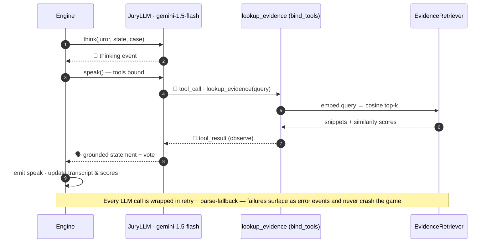
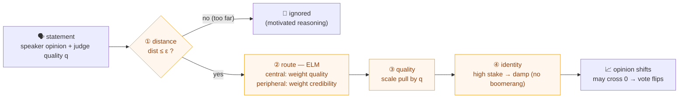

# ⚖️ Jury Deliberation Simulator

A playable, web-based **multi-agent LLM jury room**. Five AI jurors — each with a
distinct persona, cognitive bias, and leaning — deliberate a criminal case
alongside *you*, the human juror. The jurors **look evidence up with a tool**
before they argue (RAG + function calling + ReAct), shift their votes round by
round, and an **LLM-as-a-Judge** grades your participation at the end.

> Refactored and extended from a Kaggle GenAI Capstone notebook into a
> front-/back-end application.


---

## ✨ Highlights

- **Multi-Agent deliberation** — 5 LLM juror agents + 1 human, turn-based rounds,
  score-driven speaking order and response interjections.
- **RAG evidence tool** — case evidence embedded with Gemini `text-embedding-004`,
  cosine top-k retrieval, exposed to jurors via LangChain `bind_tools`
  (Gemini-native **function calling**).
- **ReAct loop** — think → call `lookup_evidence` → observe → grounded statement,
  streamed live to the UI as a visible trace.
- **LLM-as-a-Judge** — 5-dimension rubric (0–100) scores your performance + recap.
- **Robust** — every LLM call has retry + parse fallback + surfaced error events;
  a flaky API never crashes the game.
- **Live streaming UI** — FastAPI **SSE** backend, **React + Vite** front-end with
  juror cards, evidence highlighting, vote tally, and the ReAct trace.
- **CDA belief engine (opt-in)** — psychologically-grounded belief change
  (bounded-confidence + ELM + cognitive dissonance), agent **Theory of Mind** +
  targeted persuasion, true **token streaming**, and live belief/strategy/metrics
  in the UI. See [CDA](#-cda--cognitive-deliberation-architecture-opt-in).

## 🧱 Architecture


The engine is an async coroutine that streams structured events through `emit`
and **pauses on `await get_human_action()`** when it's your turn.

## 🔄 The deliberation loop

Each round cycles through four phases. Speaking order and cross-juror rebuttals
are **score-driven**, so the room reshuffles every round instead of replaying a
fixed script.

<p align="center">
  
</p>

<details>
<summary>📐 Mermaid source</summary>


</details>

> **Score dynamics:** after a juror speaks, their `speaking_score` decays (×0.6)
> while everyone else's `responding_score` climbs (+0.08). Your human input nudges
> every responder up (+0.05) — so talking actually changes who speaks next.

## 🔍 Anatomy of a juror turn — RAG + function calling + ReAct

A juror never argues from thin air. Every statement runs a **think → call tool →
observe → speak** loop, and each step is emitted as a discrete event so the UI
can render the reasoning trace live.



## 🧠 CDA — Cognitive Deliberation Architecture (opt-in)

By default jurors argue from generic prompts. Flip on the **CDA** layer and belief
change becomes **psychologically grounded, traceable, and controllable**: each juror
holds a structured belief, **reads its opponents (Theory of Mind)**, and aims its
argument at the most persuadable one. Every piece is **additive + flag-gated**, so
the default path (and the test suite) is untouched.

### A statement must pass four gates to move a listener
`jury/beliefs.py` — pure numpy, deterministic, no LLM:



Grounded in **bounded-confidence opinion dynamics**, the **Elaboration Likelihood
Model**, and **cognitive dissonance / motivated reasoning** — high-identity beliefs
*resist* rather than reverse (no backfire effect, per PNAS 2019). Opinion is a signed
scalar in `[-1, 1]`; a pull that drags it across zero flips the stance.

### Theory of Mind + targeted persuasion
Before speaking, each juror **infers** every opponent's lean, weakest point, and
openness (`jury/tom.py`, via the model — a genuine guess with information asymmetry,
not a peek at the truth). Then `jury/strategy.py` picks **who to move** (the closest
disagreer) and **how** — open target → attack the weak point with evidence; closed →
find common ground first (ELM-matched). The chosen move conditions the spoken
argument, and a `strategy` event (*"Marian → targets Priya · attack_weakest"*) streams
to the UI.

### Flags
| Env var | Turns on |
|---|---|
| `JURY_BELIEFS=1` | belief stack + 4-gate updates + belief-aware speaking order + belief-driven votes |
| `JURY_TOM=1` | Theory-of-Mind reads + targeted persuasion + Toulmin arguments (requires BELIEFS) |
| `JURY_STREAM=1` | true token streaming of utterances (`speak_delta`) via RAG pre-fetch |
| `JURY_REFLECT=1` | periodic one-line self-reflection |
| `JURY_FAST_MODEL=…` | cheap model tier for judge / ToM / args / reflection |
| `JURY_LANGGRAPH=1` | run the deliberation via a **LangGraph** `StateGraph` (same phases as nodes) |
| `JURY_TRACE=1` | structured per-event tracing to logs (observability) |

Demo the full stack: `JURY_BELIEFS=1 JURY_TOM=1 JURY_STREAM=1 JURY_REFLECT=1 uvicorn server:app`.

### Standards & infra
- **MCP server** (`backend/mcp_server.py`) re-exposes the evidence RAG as a
  **Model Context Protocol** tool: `python backend/mcp_server.py` → any MCP client can call
  `lookup_evidence`.
- **LangGraph** (`jury/graph.py`) — an opt-in `StateGraph` orchestration that reuses the exact
  phase functions, so it's behavior-identical to the hand-rolled loop (verified by a test).
- **Structured outputs** via pydantic (`jury/schemas.py`); **observability** (`jury/obs.py`);
  **offline eval harness** (`python -m jury.evalrun N`); **Docker + Compose + GitHub Actions CI**.

### Modules (all additive)
| File | Role |
|---|---|
| `jury/beliefs.py` | 4-gate belief-update engine (pure numpy) |
| `jury/tom.py` | per-opponent Theory-of-Mind inference |
| `jury/strategy.py` | target + tactic selection (pure Python) |
| `jury/scheduler.py` | belief-aware drive speaking order |
| `jury/metrics.py` | convergence · polarization · who-convinced-whom |

## 🐳 Run with Docker (one command)

```bash
GEMINI_API_KEY=sk-... docker compose up --build         # → http://localhost:5173
JURY_FAKE_LLM=1 docker compose up --build               # offline, no API key
JURY_BELIEFS=1 JURY_TOM=1 JURY_STREAM=1 GEMINI_API_KEY=… docker compose up --build   # full CDA
```
Backend (FastAPI/SSE) and frontend (nginx, proxies `/api` → backend) build into two
containers. CI (GitHub Actions) runs the pytest suite + frontend build on every push.

## 🚀 Run it (local, live Gemini)

Get a free key from Google AI Studio.

**Backend**
```bash
cd backend
cp .env.example .env          # paste your GEMINI_API_KEY
python -m venv .venv && source .venv/bin/activate
pip install -r requirements.txt
uvicorn server:app --reload   # http://localhost:8000
```

**Frontend**
```bash
cd frontend
npm install
npm run dev                   # http://localhost:5173
```

Open http://localhost:5173, *Convene the jury*, watch the jurors deliberate and
pull evidence, then take your turn (Speak / Hint / Vote / Abstain / Exit).

**Terminal-only smoke test** (no frontend): `cd backend && python cli.py`

**Offline mode (no API key)** — boot the full HTTP + SSE + engine pipeline with a
deterministic stub LLM (RAG still runs over a local embedder), useful for CI /
demos:
```bash
JURY_FAKE_LLM=1 uvicorn server:app   # create a game; jurors deliberate without Gemini
```

> If requests to `localhost` return a proxy **403** (e.g. a squid proxy intercepts
> everything), set `no_proxy=localhost,127.0.0.1` before running.

## 🧪 Tests

```bash
cd backend && pytest          # RAG retrieval · engine/ReAct events · fallback · API
```

## 🔍 How the resume claims map to code

| Claim | Where |
|---|---|
| 5 jurors + human, dual init mode | `jury/personas.py` |
| Gemini 1.5 Flash / text-embedding-004 | `jury/llm.py`, `jury/rag.py` |
| RAG cosine top-k | `jury/rag.py` `EvidenceRetriever.lookup` |
| `bind_tools` + manual ReAct tool-loop | `jury/llm.py` `_statement` |
| 6 prompt templates (speak/respond/vote/hint/recap/rolegen) | `jury/prompts.py` |
| immutable frozen dataclass + TypedDict | `jury/state.py` |
| LLM-as-a-Judge rubric | `jury/eval.py`, `jury/llm.py` `rubric` |
| multi-level fallback | `jury/llm.py` `_safe` |
| SSE streaming + React viz | `server.py`, `frontend/src/` |

## ⚠️ Notes & caveats

- **Live mode only** — needs a Gemini API key; calls Google in real time.
- **In-memory game store** (`server.py` `GAMES` dict) — single process, fine for a
  local demo, not horizontally scalable.
- The `JurorState` is a frozen dataclass with a TypedDict serialization shape;
  the deliberation loop is hand-rolled (it does **not** use LangGraph).
